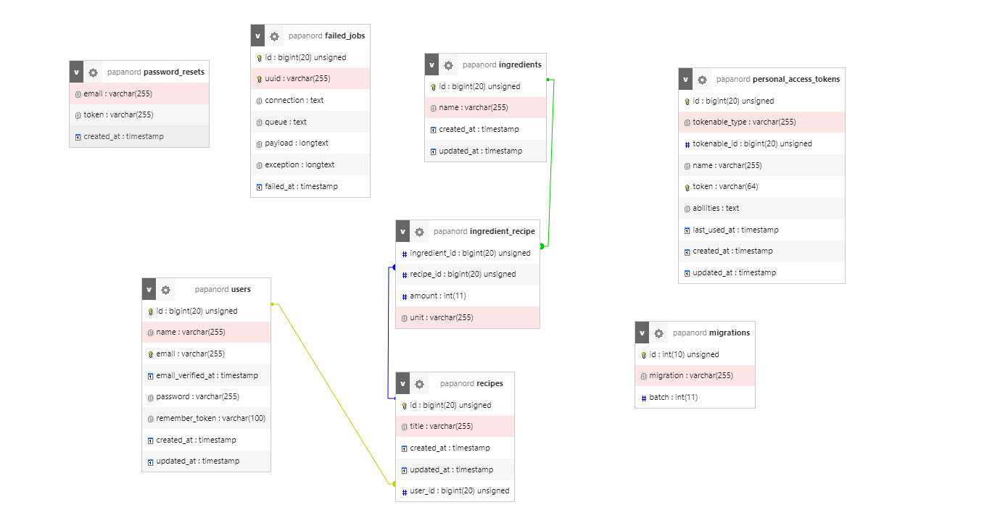
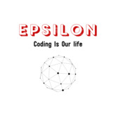

#  Application de gestion de recettes

Ce Projet permet de comprendre les notions suivante :

 <ol>
<li>les Composants Blade</li>
<li>l'Authentification</li>
<li>la relation Many To Many avec des champs dans la table Pivot</li>
<li>un brin d'AlpineJS et les View Composer</li>
</ol>

# Shemas de la base de donnée 

# Autheur

     

